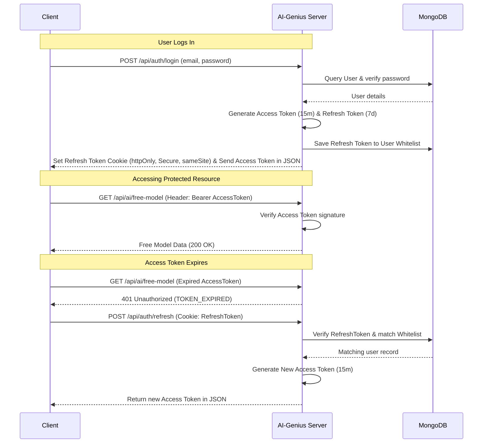

# AI-Genius 🧠

AI-Genius is a robust, production-ready RESTful API backend built with Node.js, Express, and MongoDB. It features a complete authentication flow using JSON Web Tokens (JWT) with secure double-token cookie rotation, role-based authorization control, and mock AI generation endpoints customized for different user tiers.

---

## 🚀 Key Features

*   **Secure Authentication**: Secure sign-up and sign-in processes featuring salt-hashed passwords with `bcryptjs`.
*   **Double-Token JWT Auth System**:
    *   **Short-Lived Access Tokens**: Signed tokens (`15m` default) passed in the `Authorization: Bearer <token>` header for stateless authentication.
    *   **Long-Lived Refresh Tokens**: Secure, `httpOnly`, `sameSite: strict` refresh cookies (`7d` default) used to safely obtain new access tokens.
    *   **Refresh Token Whitelist / Reuse Detection**: Refresh tokens are tracked in the database. Logging out purges the whitelist, preventing token reuse.
*   **Role-Based Access Control (RBAC)**: Custom authorization middleware to protect endpoints and restrict actions according to user tiers:
    *   `Free_User`: General access to free resources.
    *   `Premium_User`: Access to advanced/premium tools.
    *   `Admin`: Full system administration capabilities, including system cache management.
*   **Centralized Error Handling**: Express middleware that intercepts database constraint violations (e.g., duplicate emails), validation errors, and signature exceptions to return structured, clean client-side error responses.

---

## 🛠️ Tech Stack

*   **Runtime Environment**: Node.js
*   **Framework**: Express.js
*   **Database ORM**: MongoDB & Mongoose
*   **Authentication & Security**: JSON Web Tokens (`jsonwebtoken`), `bcryptjs`, and `cookie-parser`

---

## 📁 Project Structure

```text
ai-genius/
├── config/
│   ├── db.js             # Database connection setup using Mongoose
│   └── jwt.js            # Access & Refresh token generation and cookie configs
├── controllers/
│   ├── aiController.js   # Controllers for AI generation logic & administrative tasks
│   └── authController.js # Controllers for registration, login, token refresh, and logout
├── middleware/
│   ├── authMiddleware.js # Authentication checks and role restriction checks
│   └── errorHandler.js   # Centralized error handler (validation, duplicates, etc.)
├── models/
│   └── User.js           # Mongoose Schema for User accounts (handles hashing & methods)
├── routes/
│   ├── aiRoutes.js       # AI API route endpoint mapping
│   └── authRoutes.js     # Authentication route endpoint mapping
├── .env.example          # Template for required environment variables
├── package.json          # Node dependencies and scripts
└── server.js             # Application entry point and Express server setup
```

---

## ⚙️ Getting Started

### Prerequisites

*   [Node.js](https://nodejs.org/) (v16+ recommended)
*   [MongoDB](https://www.mongodb.com/) (Local instance or MongoDB Atlas URI)

### Installation

1.  **Clone the repository** and navigate to the project directory:
    ```bash
    git clone <repository-url>
    cd ai-genius
    ```

2.  **Install the dependencies**:
    ```bash
    npm install
    ```

3.  **Configure Environment Variables**:
    Copy the `.env.example` file to a new file named `.env`:
    ```bash
    cp .env.example .env
    ```
    Open `.env` and fill in your details:
    ```env
    PORT=5000
    MONGO_URI=your_mongodb_connection_string
    JWT_SECRET=your_super_secret_access_key
    JWT_REFRESH_SECRET=your_super_secret_refresh_key
    JWT_ACCESS_EXPIRES=15m
    JWT_REFRESH_EXPIRES=7d
    NODE_ENV=development
    ```

4.  **Start the Server**:
    Run the application using Node:
    ```bash
    node server.js
    ```
    *The server will run on the port defined in `.env` (default is `5000`).*

---

## 📡 API Reference

All requests must use `Content-Type: application/json`.

### 1. Authentication Endpoints (`/api/auth`)

#### **Register a New User**
*   **URL**: `/api/auth/register`
*   **Method**: `POST`
*   **Request Body**:
    ```json
    {
      "email": "user@example.com",
      "password": "password123",
      "role": "Free_User" 
    }
    ```
    *(Options for `role`: `Free_User` (default), `Premium_User`, `Admin`)*
*   **Success Response** (Code: `201`):
    ```json
    {
      "status": "success",
      "message": "User registered successfully.",
      "user": {
        "id": "64beab12...",
        "email": "user@example.com",
        "role": "Free_User"
      }
    }
    ```

#### **Log In**
*   **URL**: `/api/auth/login`
*   **Method**: `POST`
*   **Request Body**:
    ```json
    {
      "email": "user@example.com",
      "password": "password123"
    }
    ```
*   **Success Response** (Code: `200`):
    *   *Sets an HTTP-only cookie `refreshToken`.*
    ```json
    {
      "status": "success",
      "message": "Login successful.",
      "accessToken": "eyJhbGciOi...",
      "user": {
        "id": "64beab12...",
        "email": "user@example.com",
        "role": "Free_User"
      }
    }
    ```

#### **Refresh Access Token**
*   **URL**: `/api/auth/refresh`
*   **Method**: `POST`
*   **Headers**: *None required (reads the `refreshToken` from httpOnly cookies)*
*   **Success Response** (Code: `200`):
    ```json
    {
      "status": "success",
      "message": "Access token refreshed.",
      "accessToken": "new_eyJhbGciOi..."
    }
    ```

#### **Log Out**
*   **URL**: `/api/auth/logout`
*   **Method**: `POST`
*   **Success Response** (Code: `200`):
    *   *Clears the HTTP-only `refreshToken` cookie and nullifies it in the database.*
    ```json
    {
      "status": "success",
      "message": "Logged out successfully."
    }
    ```

---

### 2. AI Model Endpoints (`/api/ai`)
*All endpoints in this section require a valid access token sent in the Authorization header:*
`Authorization: Bearer <accessToken>`

#### **Get Free Tier Response**
*   **URL**: `/api/ai/free-model`
*   **Method**: `GET`
*   **Authorization**: Any authenticated user (`Free_User`, `Premium_User`, `Admin`)
*   **Success Response** (Code: `200`):
    ```json
    {
      "status": "success",
      "model": "free-text-v1",
      "message": "Hello user@example.com! Here is your free AI response.",
      "output": "The quick brown fox jumps over the lazy dog. [Free Tier Output]",
      "accessedBy": {
        "id": "64beab...",
        "email": "user@example.com",
        "role": "Free_User"
      }
    }
    ```

#### **Generate Premium Response**
*   **URL**: `/api/ai/premium-model`
*   **Method**: `POST`
*   **Authorization**: `Premium_User` or `Admin` only
*   **Request Body**:
    ```json
    {
      "prompt": "Create an image of a futuristic workspace"
    }
    ```
*   **Success Response** (Code: `200`):
    ```json
    {
      "status": "success",
      "model": "premium-image-gen-v3",
      "message": "Premium model accessed by Premium_User.",
      "prompt": "Create an image of a futuristic workspace",
      "output": "[High-resolution AI-generated image data would be here]",
      "tokensUsed": 450,
      "accessedBy": {
        "id": "64beab...",
        "email": "premium@example.com",
        "role": "Premium_User"
      }
    }
    ```

#### **Purge Cache**
*   **URL**: `/api/ai/purge-cache`
*   **Method**: `DELETE`
*   **Authorization**: `Admin` only
*   **Success Response** (Code: `200`):
    ```json
    {
      "status": "success",
      "message": "AI model cache purged successfully.",
      "purgedAt": "2026-06-06T10:00:00.000Z",
      "performedBy": {
        "id": "64beab...",
        "email": "admin@example.com",
        "role": "Admin"
      }
    }
    ```

---

## 🔒 Security & Auth Architecture Flow

AI-Genius implements token authentication security:



---

## 🤝 Contributing

Contributions are welcome! Please feel free to open a Pull Request or report an issue if you encounter any bugs.
